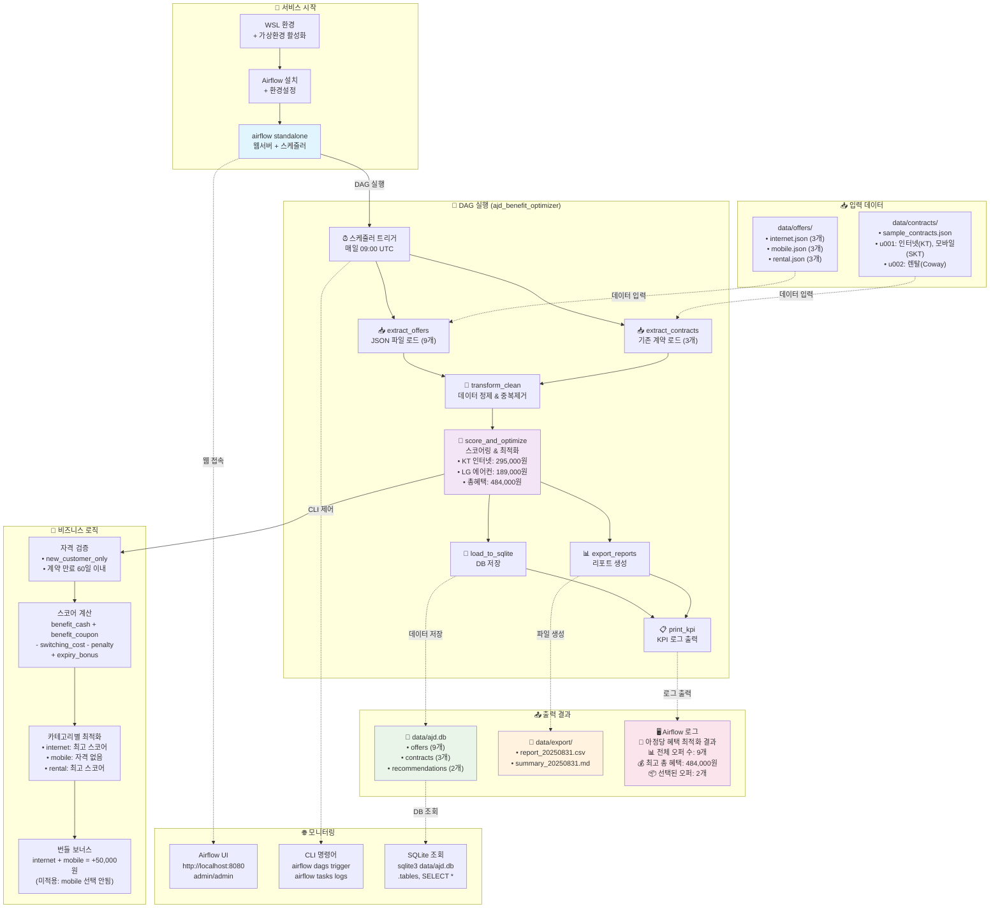

# 아정당 혜택 최적화 서비스 전체 실행 흐름

## 📊 실행 결과 기반 플로우 다이어그램

**실행일시**: 2025-08-31 17:30:35  
**처리 결과**: 총 9개 오퍼 중 2개 선택, 484,000원 혜택



## 📋 실행 흐름 상세 설명

### 1️⃣ 서비스 시작 단계
- **WSL 환경**: Linux 환경에서 실행
- **가상환경**: uv로 Python 3.11 환경 구성
- **Airflow 설치**: apache-airflow 2.9.2 + 의존성

### 2️⃣ 입력 데이터 구조
- **오퍼 데이터**: 9개 상품 (인터넷 3개, 모바일 3개, 렌탈 3개)
- **계약 데이터**: 3개 기존 계약 (u001: 2개, u002: 1개)

### 3️⃣ DAG 실행 프로세스
1. **extract_offers**: JSON 파일에서 9개 오퍼 로드
2. **extract_contracts**: 3개 기존 계약 로드
3. **transform_clean**: 데이터 검증 및 정제
4. **score_and_optimize**: 비즈니스 룰 적용 최적화
5. **load_to_sqlite**: 결과를 SQLite DB에 저장
6. **export_reports**: CSV/MD 리포트 생성
7. **print_kpi**: KPI 로그 출력

### 4️⃣ 비즈니스 로직 핵심
- **자격 검증**: 신규 고객 조건, 계약 만료 임박 확인
- **스코어 계산**: 혜택 - 비용 + 보너스
- **카테고리별 제약**: 각 카테고리 최대 1개 선택
- **번들 보너스**: 인터넷+모바일 조합 시 추가 혜택

### 5️⃣ 실제 실행 결과 (2025-08-31)
- **선택된 오퍼**: 
  - KT 1G 36개월 (인터넷): 295,000원
  - LG 에어컨 렌탈: 189,000원
- **총 혜택**: 484,000원
- **모바일**: 자격 조건 미충족으로 미선택

### 6️⃣ 출력 및 모니터링
- **데이터베이스**: `data/ajd.db` SQLite 파일
- **리포트**: CSV (상세), MD (요약)
- **로그**: Airflow UI 및 CLI로 실시간 모니터링

## 🔧 실행 명령어 요약

```bash
# 환경 설정
cd /mnt/c/Users/jaeke/ajungdang/airflow-home
source .venv/bin/activate
export AIRFLOW_HOME=$(pwd)

# 서비스 시작
airflow standalone &

# DAG 실행
airflow dags trigger ajd_benefit_optimizer

# 결과 확인
sqlite3 data/ajd.db "SELECT * FROM recommendations;"
cat data/export/summary_$(date +%Y%m%d).md
```

---
*생성일시: 2025-08-31*  
*기반 데이터: 실제 DAG 실행 결과*
